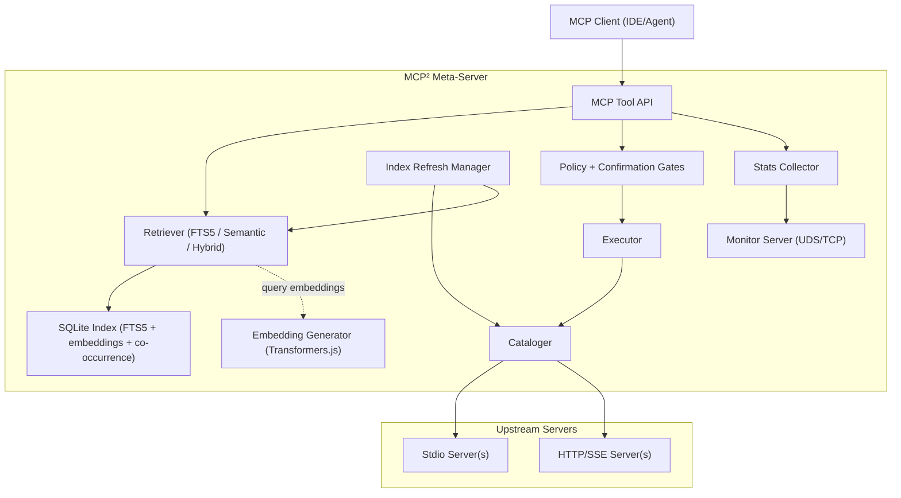

# MCP²: Architecture Overview

## High-Level Diagram

## Request Flow

1. **Catalog & Index**: The Cataloger connects to all configured upstream servers and ingests their tool definitions. The Index Refresh Manager periodically refreshes upstreams, detects changes, and re-syncs the local index.
2. **Tool Discovery (`find_tools`)**: The Retriever searches the local index using FTS5 or embedding-based search (semantic/hybrid). Results are filtered by security policy, formatted by detail level (L0/L1/L2), and optionally augmented with co-occurrence-based suggestions.
3. **Schema Retrieval (`describe_tools`)**: Full JSON schemas are returned for requested tools, including confirmation requirements and ambiguity resolution when names collide.
4. **Execution (`execute`)**: Execution requests are checked against allow/block/confirm rules. Confirm-required tools return a short-lived token that must be provided to proceed. Successful executions are tracked for selection caching.
5. **Supporting Meta-Tools**: `list_namespaces` enumerates upstream servers and tools, and `clear_selection_cache` resets co-occurrence data.

## Indexing & Search

- SQLite (via `bun:sqlite`) stores tool metadata and an FTS5 virtual table for fast text search.
- Embeddings are stored as BLOBs and used for semantic or hybrid search.
- Embeddings are generated locally using Transformers.js (BGE-small model).
- Co-occurrence data powers selection caching and bundle suggestions.

## Safety & Policy

- Tool descriptions are sanitized to mitigate prompt-injection attempts.
- Policies use allow/block/confirm patterns with glob-style matching.
- Confirm-required tools return a short-lived token; execution is denied without it.

## Monitoring & Stats

- A monitor server (UDS/TCP) exposes real-time stats for the TUI monitor.
- Stats include request counts, latency, memory usage, index size, and embedding/co-occurrence counts.
