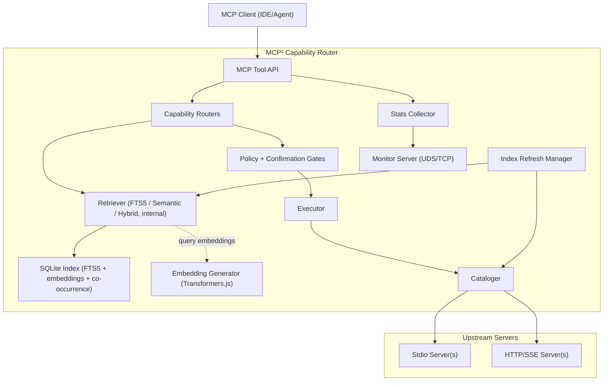

# MCP²: Architecture Overview

## High-Level Diagram

```mermaid
graph TD
    Client["MCP Client (IDE/Agent)"]

    subgraph "MCP² Capability Router"
        API["MCP Tool API"]
        Security["Policy + Confirmation Gates"]
        Router["Capability Routers"]
        Retriever["Retriever (FTS5 / Semantic / Hybrid, internal)"]
        Index["SQLite Index (FTS5 + embeddings + co-occurrence)"]
        Embeddings["Embedding Generator (Transformers.js)"]
        Executor["Executor"]
        Cataloger["Cataloger"]
        Refresh["Index Refresh Manager"]
        Stats["Stats Collector"]
        Monitor["Monitor Server (UDS/TCP)"]
    end

    subgraph "Upstream Servers"
        S1["Stdio Server(s)"]
        S2["HTTP/SSE Server(s)"]
    end

    Client --> API
    API --> Router
    Router --> Retriever
    Retriever --> Index
    Retriever -. "query embeddings" .-> Embeddings
    Router --> Security
    Security --> Executor
    Executor --> Cataloger
    Cataloger --> S1
    Cataloger --> S2
    Refresh --> Cataloger
    Refresh --> Retriever
    API --> Stats
    Stats --> Monitor
```

## Request Flow

1. **Catalog & Index**: The Cataloger connects to all configured upstream servers and ingests their tool definitions. The Index Refresh Manager periodically refreshes upstreams, detects changes, and re-syncs the local index.
2. **Connect-Time Surface Build**: At session creation, MCP² infers namespace capabilities and registers one public tool per non-empty capability (`code_search`, `docs`, etc.). Upstream identifiers stay internal. In `hybrid` inference mode, embedding-based semantic classification runs during `startCore()` and pre-computes overrides that are merged before the sync routing chain executes (user config overrides always win).
3. **Action Introspection (`action = "__describe_actions"`)**: Each capability router returns a capability-local action catalog with summaries, input schemas, and confirmation requirements.
4. **Execution**: Capability/action requests are checked against allow/block/confirm rules (`capability:action`). Confirm-required actions return a short-lived token bound to that capability/action. Successful executions are tracked for selection caching.
5. **Internal Dispatch**: Router actions resolve deterministically to upstream qualified tool calls, then execute through the cataloger.

## Indexing & Search

- SQLite (via `bun:sqlite`) stores tool metadata and an FTS5 virtual table for fast text search.
- Embeddings are stored as BLOBs and used for semantic or hybrid search.
- Embeddings are generated locally using Transformers.js (BGE-small model).
- Co-occurrence data powers selection caching and bundle suggestions.

## Safety & Policy

- Tool descriptions are sanitized to mitigate prompt-injection attempts.
- Policies use allow/block/confirm patterns with glob-style matching on `capability:action`.
- Confirm-required tools return a short-lived token; execution is denied without it.

## Monitoring & Stats

- A monitor server (UDS/TCP) exposes real-time stats for the TUI monitor.
- Stats include request counts, latency, memory usage, index size, and embedding/co-occurrence counts.

## Taxonomy Evolution

The public router surface intentionally uses stable canonical capability IDs because
security policy matching, config overrides, and client tool calls all depend on
predictable `capability:action` contracts. Richer internal classification and
adapter-specific bucket mappings should be layered underneath that public API
rather than replacing it with runtime-generated categories.

See `docs/capability-taxonomy-design.md` for the proposed canonical capability +
facet + adapter-projection model.
