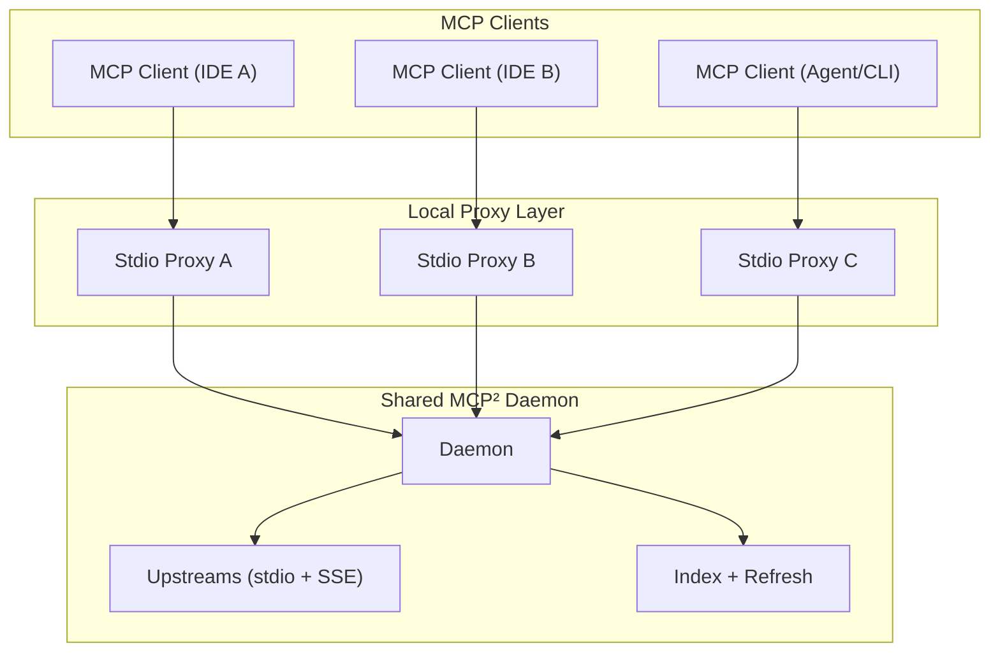

# Shared MCP Daemon Design

Status: Draft  
Last updated: 2026-02-03  
Owners: MCP² maintainers

## Problem Statement

When multiple MCP clients (IDE tools, agents, or CLIs) each launch their own `mcp-squared` process, we duplicate:

- Upstream MCP server processes (stdio)
- SSE connections
- Periodic refresh and indexing work
- In-memory indexes and caches

This multiplies CPU and memory usage linearly with the number of clients. We need a shared daemon that allows multiple stdio proxies to use a single MCP² backend.

## Goals

- One shared daemon owns upstream connections, index, and refresh loop.
- Multiple stdio proxies can connect concurrently.
- The first proxy to connect becomes the owner.
- Ownership transfers on owner disconnect.
- Daemon exits when the last proxy disconnects.
- Works on macOS/Linux/Windows.
- Language-agnostic design.

## Non-Goals

- Remote multi-user access or authentication beyond local user isolation.
- Rewriting the MCP protocol itself.
- Introducing a mandatory HTTP server.

## High-Level Architecture



## Components

Daemon:
- Long-lived process that owns upstream connections and indexing.
- Accepts multiple concurrent client sessions.
- Maintains ownership and shutdown policy.

Stdio Proxy:
- One per MCP client.
- Speaks MCP over stdio to the client.
- Forwards messages to the daemon over a local socket.

Registry:
- Well-known location storing daemon endpoint metadata.
- Used to discover, connect to, or spawn a daemon.

## Registry

Location (example, OS-specific):
- macOS/Linux: `~/.config/mcp-squared/daemon/<configHash>/daemon.json`
- Windows: `%APPDATA%\\mcp-squared\\daemon\\<configHash>\\daemon.json`

Fields:
- `daemonId`
- `endpoint` (UDS path or `tcp://127.0.0.1:PORT`)
- `pid`
- `startedAt`
- `version`
- `configHash` (optional)

Rules:
- Registry writes are atomic (write temp then rename).
- Proxy checks registry on startup.
- Stale entries are removed when PID is dead or socket connect fails.
- If `configHash` mismatch, proxy starts or connects to the daemon under its own config hash directory.

## Transport

Local UDS is preferred for performance and user isolation. Local TCP is allowed when UDS is unavailable.

Endpoint examples:
- `unix:/path/to/daemon.sock`
- `tcp://127.0.0.1:45000`

## Session Model

Each proxy creates a session:
- `sessionId` (daemon assigned)
- `clientId` (proxy assigned)
- `connectedAt`
- `lastSeen`

The proxy sends heartbeats every 5 to 10 seconds. The daemon drops sessions that miss 3 intervals.

## Ownership Model

Owner is the first session to connect.
- If owner disconnects, ownership transfers to the earliest connected active session.
- Ownership is in-memory only and resets on daemon restart.

Ownership is a policy anchor:
- Owner may request daemon shutdown.
- Owner may initiate upgrades or config reloads.
- Non-owners can request but must be approved by owner or denied.

## Daemon Lifetime

Daemon runs while at least one session is active.
- When the last session disconnects, daemon starts an idle timer (for example, 5 seconds).
- If no new sessions arrive, daemon shuts down and clears the registry.
- If a new session arrives before timeout, daemon stays alive.

## Message Protocol

### Framing

Use a length-prefixed frame for daemon transport:
- 4-byte big-endian unsigned integer length `N`
- `N` bytes of UTF-8 JSON payload

Rationale:
- Avoids delimiter collisions
- Easy to implement in any language
- Supports binary-safe and streaming transports

### Envelope

Each frame is a JSON object:

```json
{
  "type": "hello | helloAck | heartbeat | goodbye | ownerChanged | mcp | error",
  "sessionId": "optional",
  "clientId": "optional",
  "payload": {}
}
```

### MCP Bridging

For MCP traffic, `payload` is the raw MCP JSON-RPC object.

Example request:

```json
{
  "type": "mcp",
  "sessionId": "s-123",
  "payload": {
    "jsonrpc": "2.0",
    "id": "1",
    "method": "tools/list",
    "params": {}
  }
}
```

Example response:

```json
{
  "type": "mcp",
  "sessionId": "s-123",
  "payload": {
    "jsonrpc": "2.0",
    "id": "1",
    "result": {}
  }
}
```

### Handshake

Proxy → Daemon:

```json
{
  "type": "hello",
  "clientId": "c-abc",
  "payload": {
    "version": "0.1.0",
    "configHash": "optional"
  }
}
```

Daemon → Proxy:

```json
{
  "type": "helloAck",
  "sessionId": "s-123",
  "payload": {
    "daemonId": "d-789",
    "isOwner": true
  }
}
```

### Heartbeat

```json
{
  "type": "heartbeat",
  "sessionId": "s-123"
}
```

### Ownership Change

```json
{
  "type": "ownerChanged",
  "payload": {
    "ownerSessionId": "s-456"
  }
}
```

### Goodbye

```json
{
  "type": "goodbye",
  "sessionId": "s-123"
}
```

## Startup Flow

Proxy startup:
1. Check registry.
2. If no live daemon, start it.
3. Connect to daemon endpoint.
4. Send `hello`, receive `helloAck`.
5. Start heartbeat loop.
6. Forward MCP traffic.

Daemon startup:
1. Bind socket and write registry entry.
2. Accept connections and create sessions.
3. Elect owner if none.
4. Start upstream connections and indexing if not already running.

## Failure Modes

Proxy crashes:
- Daemon removes session on heartbeat timeout.
- If owner, ownership transfers.
- If last session, daemon shuts down.

Daemon crashes:
- Proxies detect disconnect, recheck registry, and start a new daemon if needed.

Registry stale:
- PID dead or socket connection fails.
- Proxy deletes entry and starts a new daemon.

## Compatibility

This design keeps stdio as the MCP client-facing transport.
- Existing MCP clients do not need changes.
- Only the proxy logic changes.

The daemon transport is internal and can evolve independently.

## Security

- UDS directory permissions restrict access to the current user.
- Optional shared secret in registry:
  - Daemon generates random token.
  - Proxy must include token in `hello`.

## Implementation Notes

- Daemon should multiplex sessions and include `sessionId` on all outbound frames.
- Proxies should forward MCP requests and responses without mutation.
- If config hash mismatch, proxy can either:
  - Start a new daemon with a distinct registry path, or
  - Reject and require user action.

## Open Questions

- Should we support multiple daemons for different configs or always re-use one?
- Should daemon allow owner-initiated reloads for config changes?
- What should the idle timeout be for shutdown?
